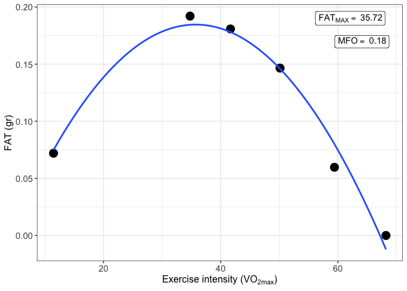
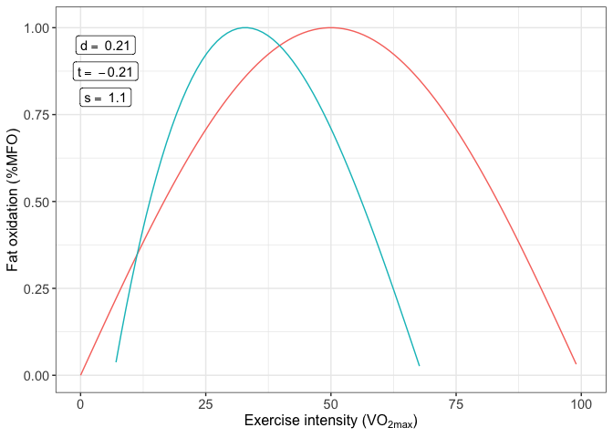

# MFO

<!-- badges: start -->

<!-- badges: end -->

## Overview

The **MFO** package have been designed to calculate the Maximal Fat
Oxidation (MFO), the exercise intensity that elicits MFO (Fatmax) and
the SIN model to represent the fat oxidation kinetics. Three variables
can be obtained from the SIN model: dilatation (d), symmetry (s) and
traslation (t).Additionally, the package allows to calculate MFO and
Fatmax of multiple subjects.

## Resources

  - [Application of MFO and
    Fatmax](https://www.tandfonline.com/doi/abs/10.1080/17461391.2020.1788650?journalCode=tejs20)
    (European Journal of Sport Science)
  - [MFO kinetics
    basis](https://journals.lww.com/acsm-msse/Fulltext/2009/08000/A_Mathematical_Model_to_Describe_Fat_Oxidation.11.aspx)
    (Medicine & Science in Sport & Exercise)

## Example

This is a basic example which shows you how to use the MFO package:

``` r
library(devtools)
install_github("JorgeDelro/MFO")
#> pillar     (1.6.2  -> 1.6.3 ) [CRAN]
#> tidyselect (1.1.0  -> 1.1.1 ) [CRAN]
#> R6         (2.5.0  -> 2.5.1 ) [CRAN]
#> lifecycle  (1.0.0  -> 1.0.1 ) [CRAN]
#> hms        (0.5.3  -> 1.1.1 ) [CRAN]
#> colorspace (2.0-1  -> 2.0-2 ) [CRAN]
#> stringi    (1.6.1  -> 1.7.5 ) [CRAN]
#> zip        (2.1.1  -> 2.2.0 ) [CRAN]
#> isoband    (0.2.4  -> 0.2.5 ) [CRAN]
#> digest     (0.6.27 -> 0.6.28) [CRAN]
#> openxlsx   (4.2.3  -> 4.2.4 ) [CRAN]
#> 
#> The downloaded binary packages are in
#>  /var/folders/3w/gywwbpd90t3crnvscmqlzf5h0000gn/T//RtmpDvFErC/downloaded_packages
#>      checking for file ‘/private/var/folders/3w/gywwbpd90t3crnvscmqlzf5h0000gn/T/RtmpDvFErC/remotes26242988e605/JorgeDelro-MFO-b54abb9/DESCRIPTION’ ...  ✓  checking for file ‘/private/var/folders/3w/gywwbpd90t3crnvscmqlzf5h0000gn/T/RtmpDvFErC/remotes26242988e605/JorgeDelro-MFO-b54abb9/DESCRIPTION’
#>   ─  preparing ‘MFO’:
#>      checking DESCRIPTION meta-information ...  ✓  checking DESCRIPTION meta-information
#>   ─  checking for LF line-endings in source and make files and shell scripts
#>   ─  checking for empty or unneeded directories
#>   ─  building ‘MFO_0.0.0.9000.tar.gz’
#>      
#> 
library(MFO)
```

First, we have to load the data which consists in 3 databases: -
basal\_df: basal metabolism database. - MFO\_df: MFO test database. -
VO2max\_df: results of a graded exercise test of which the VO2max of the
subject is going to be extracted.

``` r

# Read dfs
data(list = c("basal_df", "MFO_df", "VO2max_df"), package = "MFO")
# Convert to data.frame
basal_df <- data.frame(basal_df)
MFO_df <- data.frame(MFO_df)
VO2max_df <- data.frame(VO2max_df)
```

Then, we can used the function MFO

``` r
result_MFO <- MFO(step_time = 20,
                  db_MFO = MFO_df,
                  db_basal = basal_df,
                  db_graded = VO2max_df,
                  cv_var = "RER",
                  author = "Frayn",
                  VO2max = NULL)
```

and the MFO can be plotted

``` r
print(result_MFO$MFO_plot)
```



MFO kinetics are calculated using a database returned from MFO function
called MFO\_db.

``` r
result_MFO_kinetics <- MFO_kinetics(result_MFO$MFO_db)
```

And again the function returns a plot with the results calculated

``` r
print(result_MFO_kinetics$MFO_kinetics_plot)
```


