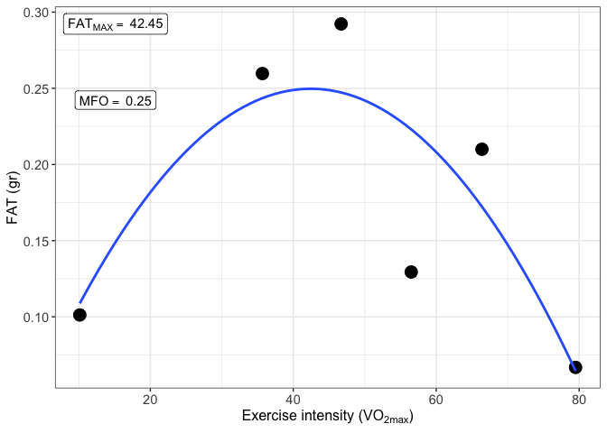
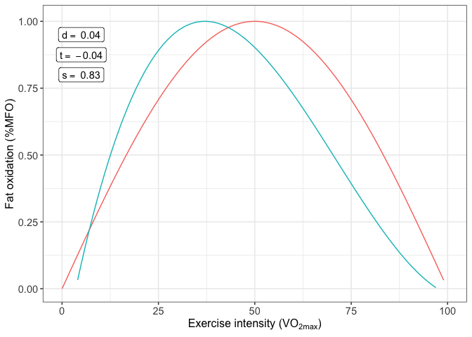

<!-- README.md is generated from README.Rmd. Please edit that file -->

# MFO

<!-- badges: start -->

[](https://travis-ci.com/JorgeDelro/MFO)
[](https://ci.appveyor.com/project/JorgeDelro/MFO)
[](https://codecov.io/gh/JorgeDelro/MFO?branch=master)
<!-- badges: end -->

## Overview

The **MFO** package have been designed to calculate the Maximal Fat
Oxidation (MFO), the exercise intensity that elicits MFO (Fatmax) and
the SIN model to represent the fat oxidation kinetics. Three variables
can be obtained from the SIN model: dilatation (d), symmetry (s) and
traslation (t).Additionally, the package allows to calculate MFO and
Fatmax of multiple subjects.

## Resources

  - [Application of MFO and
    Fatmax](https://www.tandfonline.com/doi/abs/10.1080/17461391.2020.1788650?journalCode=tejs20)
    (European Journal of Sport Science)
  - [MFO kinetics
    basis](https://journals.lww.com/acsm-msse/Fulltext/2009/08000/A_Mathematical_Model_to_Describe_Fat_Oxidation.11.aspx)
    (Medicine & Science in Sport & Exercise)

<!-- end list -->

``` r
install.packages("MFO")
```

## Example

This is a basic example which shows you how to use the MFO package:

``` r
library(MFO)
```

First, we have to read the data in **xlsx** format by using the function
read\_MFO\_databases. Two databases and four variables are necessary to
use the package: - Basal metabolism database (participant\_db\_basal). -
MFO test database (participant\_db\_MFO). - Variable: oxygen uptake
(VO2), carbon dioxide output (VCO2), heart rate (HR) and the respiratory
exchange ratio (RER). An optional database is one with the results of a
graded exercise test of which the VO2max of the subject is going to be
extracted (participant\_db\_graded).

``` r

# Path to the MFO package sample data
path <- system.file("extdata", "sample_data.xlsx", package = "MFO")

# Read databases 
sample_data <- read_MFO_databases(from = "files",
                                    path = paste(path),
                                    db_basal_name = "M.BASAL",
                                    db_MFO_name = "MFO",
                                    db_graded_name = "V02máx.",
                                    col_name_VO2 = "V'O2",
                                    col_name_VCO2 = "V'CO2",
                                    col_name_RER = "RER",
                                    col_name_HR = "HR",
                                    remove_rows = NULL)
```

Then, we can used the function MFO

``` r
result_MFO <- MFO(step_time = 20,
                  db_MFO = sample_data$participant_db_MFO,
                  db_basal = sample_data$participant_db_basal,
                  db_graded = sample_data$participant_db_graded,
                  cv_var = "RER",
                  author = "Frayn",
                  VO2max = NULL)
```

and the MFO can be plotted

``` r
print(result_MFO$MFO_plot)
```



MFO kinetics are calculated using a database returned from MFO function
called MFO\_db.

``` r
result_MFO_kinetics <- MFO_kinetics(result_MFO$MFO_db)
```

And again the function returns a plot with the results calculated

``` r
print(result_MFO_kinetics$MFO_kinetics_plot)
#> Warning: Removed 8 row(s) containing missing values (geom_path).
```


